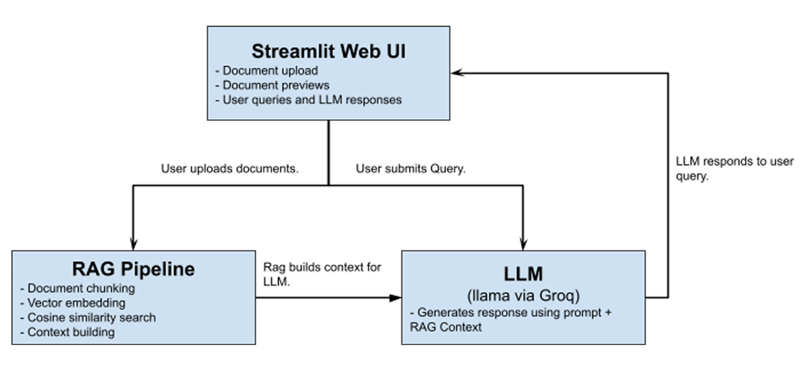

# Ludexra

## Overview
Ludexra is your personal game development assistant. Ludexra can take in your game design documents, specs, or other reference documents to become an expert on your project. Ask Ludexra a question, and as long as the answer is available in the provided documentation, Ludexra will give you an accurate answer.

## System Architecture


### Frameworks and Libraries
Ludexra is developed entirely in Python, using the Streamlit framework to build its web interface.

The app’s RAG pipeline uses the SentenceTransformer and NumPy libraries to convert text into vectors and compute cosine similarity between them.

The language model used by the Game Dev Assistant is llama-3.1-8b-instant, implemented via Groq API. 

The app also makes use of pdfplumber and python-docx for reading files.

### Document Flow
When documents are uploaded, the app reads each file to extract all text content as a string. The text is then split into chunks using a simple sliding-window chunking strategy. Each chunk is then embedded as a vector.

When the user submits a query, the query text is also embedded so that the app may find similar chunks using cosine similarity. The most similar chunks are inserted into an LLM prompt that is used to come up with a response to the query. Once a response has been generated, it gets displayed to the user in the app UI.

### RAG Implementation 
The system uses a sliding-window chunking strategy that divides text into overlapping chunks to preserve continuity and context. Chunks are currently sized at 100 words with an overlap of 25. I found that these numbers work well for the sample documents that are provided.

Chunks are embedded locally using SentenceTransformer. I chose to use this library because I wanted something free and easy to use. An additional benefit of local embedding is that it is faster than using an external API. Embeddings are stored in a NumPy array for later similarity search.

To retrieve relevant chunks, the app calculates cosine similarity between the prompt embedding and each chunk embedding. Chunks are then sorted in order by similarity to the prompt. Finally, the top 10 most similar chunks are taken and sent to the LLM prompt for response generation. I found that using the top 10 chunks produced decent responses for the sample documents provided with the app.

## How to Run Locally
Note: You may need to use Python 3.12 to run this project due to PyTorch compatibility. Running on Windows is also recommended if possible.
### 1. Clone this repository
```
git clone https://github.com/anthonyhenry/Game-Design-Knowledge-Assistant
cd Game-Design-Knowledge-Assistant
```
### 2. Create a virtual environment in your project directory
```
python -m venv venv
```
### 3. Activate the virtual environment
Windows:
```
venv\Scripts\activate
```
Mac/Linux:
```
source venv/bin/activate
```
### 4. Install dependencies within the virtual environment
```
pip install -r requirements.txt
```
### 5. Create a .env file for your groq api key
This app uses the GROQ API to use the llama-3.1-8b-instant LLM. You will need to supply a GROQ api key. You can acquire one by creating an account at  https://console.groq.com/. Once you have a GROQ API key, you must create a .env file in your directory and supply your API key like so:
```
GROQ_API_KEY = "your_api_key"
```
### 6. Run the app
In your virtual environment run:
```
streamlit run app.py
```
